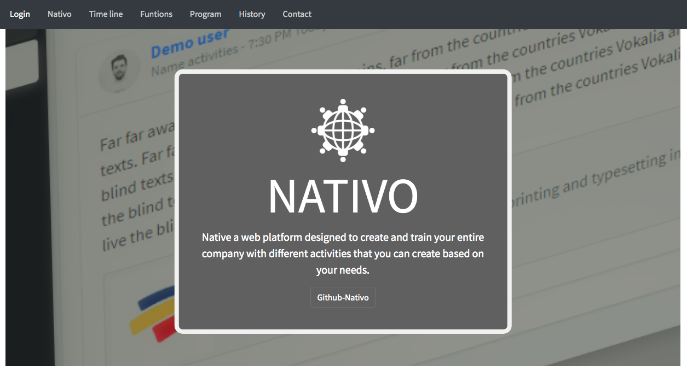

# NATIVO
Web plataform for training people in companies.

## Description
Nativo creates digital learning products designed to upskill employees with the ability to succeed in the present workplace. The training platform of Nativo is for all kinds of companies, for example, their Training, HR, L&D teams, and eLearning professionals, even the CEO of the company. We converge on the cover of several training needs, and that the employer can build online courses in minutes and start the training immediately.It allows people to train, succeed, and empower their careers. I like the idea of transformation through engagement, connection, and continuous learning and training

This is the final project of Foundations in [Holberton School Colombia](https://www.holbertonschool.com/co).

## Features
  - Create program: This function allows us to create to create a new program thata includes the name of the program, a description and we can upload thigs like images and videos.
  - Active programs: This function allows us to view the total number of active or avaible programs on the plataform, here we can view the tutor, number of activities and their priority.
  - Daily activities: This function allows us to view the active daily tasksto be solved by the user. In this field each activity can be solved using the multiple selection option.

## Tech
This project was developed with these technologies based in a framework called meanstack:

* [NodeJs] - Backend
* [Angular-9] - Frontend
* [MongoDB] - Database
* [HTML] - Frontend

## Demo
The project is in a temporary location [Link](http://161.35.98.240:8000).

## Installing and Running

You can run this project on the local machine.

### Prerequisites
You need to have and install:
```
Ubuntu 18.04 LTS
Angular 9
Node JS 12.18.1 LTS
MongoDB
```
## Deployment

This project was generated with [Angular CLI](https://github.com/angular/angular-cli) version 9.1.7.

### Development server

Run `ng serve` for a dev server. Navigate to `http://localhost:4200/`. The app will automatically reload if you change any of the source files.

### Code scaffolding

Run `ng generate component component-name` to generate a new component. You can also use `ng generate directive|pipe|service|class|guard|interface|enum|module`.

### Build

Run `ng build` to build the project. The build artifacts will be stored in the `dist/` directory. Use the `--prod` flag for a production build.

### Running unit tests

Run `ng test` to execute the unit tests via [Karma](https://karma-runner.github.io).

### Running end-to-end tests

Run `ng e2e` to execute the end-to-end tests via [Protractor](http://www.protractortest.org/).

### Further help

To get more help on the Angular CLI use `ng help` or go check out the [Angular CLI README](https://github.com/angular/angular-cli/blob/master/README.md).

## Authors
* **Samir Millan Orozco** - [GitHub](https://github.com/Gaspela04)
* **Mauricio Drada Davila** - [GitHub](https://github.com/Mauricio-KND)
* **Diego Felipe Quijano Zuñiga** - [GitHub](https://github.com/diego0096)

## Update
June, 2020
